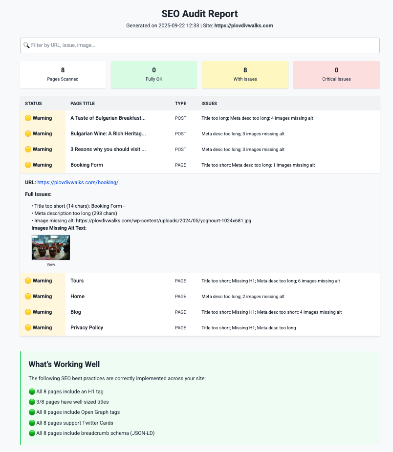

# WordPress SEO Analyzer

A lightweight, powerful Python tool to audit SEO health across all WordPress pages and posts by leveraging the WordPress REST API— without relying on third-party tools, and with straightforward tips to improve your SEO.

## Features
This script automatically:

- Crawls all published posts and pages using the WordPress REST API (/wp-json/wp/v2/posts, /wp-json/wp/v2/pages)
- Analyzes key on-page SEO elements:
  - Presence and count of H1 tags
  - Page title length (ideal: 50–60 characters)
  - Meta description presence and length (ideal: 120–155 characters)
  - Missing or empty alt attributes in images
  - Use of noindex meta tags
  - Open Graph (og:) and Twitter Card metadata
  - Breadcrumb schema (JSON-LD structured data)
  - Multiple H1s, missing titles, and other common issues
- Generates a detailed HTML report with:
  - Color-coded results (green = OK, yellow = warning, red = critical)
  - Expandable issue details per page
  - Image previews for missing alt text
  - Search functionality to filter results
  - Exports data to CSV for further analysis in spreadsheets or BI tools
  - 
Ideal for routine audits, post-migration checks, or quality assurance before publishing.

### SEO Best Practices Implemented
The analyzer follows industry-standard guidelines for optimal search engine visibility:

- Title Tags: Recommended length 50–60 characters
- Meta Descriptions: Ideal range 120–155 characters
- Image Alt Text: Must be descriptive; empty or missing values flagged
- Open Graph & Twitter Cards: Ensures proper social sharing behavior
- Schema Markup: Checks for breadcrumb and article schema
- Mobile Readiness: Evaluates readability and structure
- These rules are based on observed SERP truncation limits and best practices from Google and major platforms.

## Demo
View a sample HTML report generated by this tool:

[Sample Report](seo_report.html)

The report includes interactive features such as filtering, expandable rows, and direct links to problematic pages and images.

## Installation
1. Clone the repository:
git clone https://github.com/yourusername/wordpress-seo-analyzer.git
cd SEO_analyzer

2. Install required dependencies:
pip3 install requests beautifulsoup4
2. Run the script and enter your site's URL when prompted:
python3 seo.py

The script will:

- Discover all published posts and pages via the WordPress REST API
- Fetch and analyze each page
- Generate two output files:
seo_report_plovdivwalks.com.html – Interactive HTML report
seo_report_plovdivwalks.com.csv – Structured CSV export
The HTML report opens automatically in your default browser after generation.

### More info:
Originally created for Plovdivwalks.com by Victoria Gastón, with the help of Qwen for refinment 

